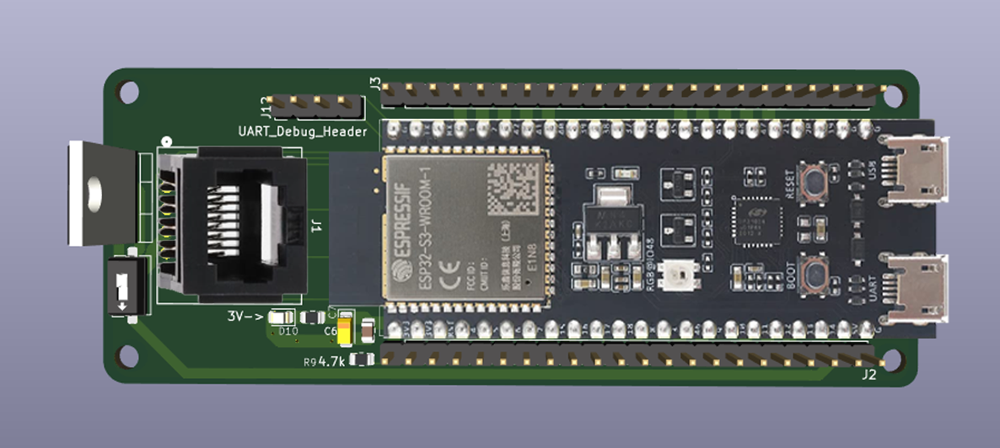

# HoloCade Child Shield

**Also known as:** LBCS

## Overview



The Child Shield is a simplified derivative of the Universal Shield (HCUS). It keeps the same ESP32-S3 parent ECU pin map and Ethernet PHY but reduces the aux bus to **one** RJ45 port and drops CAN entirely. The goal is to provide a tiny, inexpensive parent/child hybrid board for installations that only need a single downstream device or a dedicated “mini HCUS” inside a prop or remote enclosure.

**Current design goals:**
- 1× RJ45 (Ethernet only). No CAN, no extra ADC/PWM breakouts.
- Powered either from the parent HCUS via the PoE/DIP/diode rail **or** from a local USB‑C Li‑ion pack (5 V input only).
- No onboard buck converter, reverse-polarity MOSFET, or fan header—the board expects regulated 5 V and relies on passive cooling.
- Keep the ESP32-S3 personality-adapter footprint for firmware parity with HCUS.
- Target the smallest possible PCB outline for costume props, handheld gadgets, and wireless sensor clusters.

> Until this document is fleshed out, refer to the [Universal Shield README](../HoloCade_Universal_Shield/README.md) for fully documented schematics, BOM, and power notes. The Child Shield uses that design as its baseline.

---

## Documentation Template (to be completed)

The sections below intentionally keep the same structure as the Universal Shield README. Each section contains a short note describing what still needs to be written for the Child Shield variant.

<details>
<summary><strong>Electronic Control Unit (ECU)</strong></summary>

<div style="margin-left: 20px;">
Provide a summarized ECU primer tailored to the Child Shield. Emphasize that this board is meant for ultra-lightweight, Ethernet-only nodes (wearables, handheld props, remote sensors) that either sip power from HCUS or carry their own USB‑C battery.
</div>

</details>

<details>
<summary><strong>Child Shield Role in the HCUS Ecosystem</strong></summary>

<div style="margin-left: 20px;">
Explain how the Child Shield can operate as:
- A “micro parent” when only one Ethernet child device is required.
- A pre-wired breakout that ships with finished props or costume pieces (power via USB‑C).
- A remote Ethernet-only repeater that backhauls data to a full HCUS when PoE is toggled on.
Document the rules for when to toggle PoE off (battery-powered mode) vs on (HCUS-powered mode), and reiterate that no CAN bus is present on this variant.
</div>

</details>

<details>
<summary><strong>Motivation / Modularity Advantage</strong></summary>

<div style="margin-left: 20px;">
Describe the cost/space savings of a single-port shield vs. an 8-port backplane. Document the target BOM (<$15 at scale) and the intended use cases (wearables, props, distributed IoT nodes).
</div>

</details>

<details>
<summary><strong>Key Features (Child Shield)</strong></summary>

<div style="margin-left: 20px;">
- 1× RJ45 aux port (Ethernet only; same pin map as AUX1 on HCUS)
- ESP32-S3 socket (same as Universal Shield) for firmware compatibility
- Power flexibility: accepts 5 V from HCUS PoE rail or from local USB‑C input
- No CAN transceiver, no LM2576 buck converter, no fan header
- Reduced board outline sized for small enclosures (exact dimensions TBD)
</div>

</details>

<details>
<summary><strong>High-Level Block Diagram</strong></summary>

<div style="margin-left: 20px;">
Add a simplified ASCII diagram once schematic capture begins. Use the Universal Shield diagram as a starting point, but replace the 8-port block with a single “Aux Port J1” call-out.
</div>

</details>

<details>
<summary><strong>Project Files</strong></summary>

<div style="margin-left: 20px;">
Planned filenames (to be created when schematic/PCB are captured):
- `HoloCade_Child_Shield.kicad_pro`
- `HoloCade_Child_Shield.kicad_sch`
- `HoloCade_Child_Shield.kicad_pcb`
- `HoloCade_Child_Shield.kicad_prl`
Note: Until those exist, the folder contains a working copy of the Universal Shield project as a springboard.
</div>

</details>

<details>
<summary><strong>Power Architecture</strong></summary>

<div style="margin-left: 20px;">
Document the simplified power path:
- 5 V PoE from HCUS → DIP switch → diode → RJ45 pin 4
- Optional USB‑C 5 V input (with reverse-current blocking so it doesn’t backfeed HCUS)
- ESP32-S3 VIN receives 5 V directly (no onboard buck). Note USB‑C current limit assumptions.
Clarify fuse strategy (likely deferred to parent HCUS) and diode usage.
</div>

</details>

<details>
<summary><strong>Component Set / BOM</strong></summary>

<div style="margin-left: 20px;">
Create a slimmed-down BOM once the schematic is finalized. Expected parts:
- ESP32-S3 headers + UART debug header
- LAN8720A PHY + 25 MHz crystal + magnetics
- Single RJ45 (MTJ-883X1 or similar)
- USB‑C connector (5 V only, no PD)
- DIP switch + Schottky diode for PoE gating
- Bypass caps, status LEDs, optional ESD protection
</div>

</details>

<details>
<summary><strong>Aux Port Pinout (Single-Port)</strong></summary>

<div style="margin-left: 20px;">
Reuse the T568B table from the Universal Shield but annotate that only J1 exists. Clarify how ADC/PWM mapping changes (likely reusing AUX1 nets).
</div>

</details>

<details>
<summary><strong>Enclosure / Mechanical Notes</strong></summary>

<div style="margin-left: 20px;">
- Planned enclosure: **Polycase TerraForm TF-1741TX** (ABS, tool-less lid) – [Product page](https://www.polycase.com/tf-1741tx). Fits a single RJ45, USB-C, and low-profile ESP32 module. Document mounting-hole pattern once the PCB outline is finalized.
- Add measurements for the smaller board, recommended potting volumes, and any mounting-hole changes once the layout exists. Capture whether standoffs align with the TF-1741TX bosses or require adhesive-backed posts.
</div>

</details>

<details>
<summary><strong>Future Work</strong></summary>

<div style="margin-left: 20px;">
- Finalize schematic/layout
- Generate dedicated 3D models and assembly drawings
- Produce a minimal BOM + fabrication notes
- Write firmware notes for "single-port parent" mode
- **TP4056 Battery Integration** - Integrate TP4056 USB-C lithium battery charging module directly onto the Child Shield PCB with exposed battery connection pads (B+/B-). Enables portable, battery-powered operation for wearable props, handheld gadgets, and remote sensor clusters. Includes power path management (USB-C charging + battery power), boost converter for 5V output (ESP32 dev board compatibility), and battery protection circuitry. See v2.0 roadmap for implementation details.
</div>

</details>

<details>
<summary><strong>High-Level Component Diagram</strong></summary>

<div style="margin-left: 20px;">

```
          ┌────────────────────────────────────────┐
          |                                        │
    ┌─────▲───────┐    ┌───────┐ +5V               │
    │ Barrel Jack │───→│LM2576 │────┐       ┌──────▼───────┐
    │  12V/24V    │    │ Buck  │    │       │ 12/24V Fan   │
    └─────────────┘    └───────┘    │       └───────┬──────┘
                           │+5V     │               ▼
                           │        │  ┌────────────────────────┐
                           │        └─→│         ESP32-S3       │
                           │           │      (Motherboard)     │
                           │           └──▲──────────────▲──────┘
                           │              │              │
                           │         ┌────▼────┐    ┌────▼────┐
                           │         │LAN8720A │    │ADM3057E │
                           │         │Ethernet │    │ CAN-FD  │
                           │         └────▲────┘    └────▲────┘
                           │              │              │
                           │              │         ┌────▼─────┐
                           │              │         │CAN 3-pin │
                           │              │         └──────────┘         
                    ┌──────▼──────────────▼──────────────────┐   
                    │  Aux Ports: J1 J2 J3 J4 J5 J6 J7 J8    │   
                    │  (8× RJ45: Ethernet + 5V + ADC/PWM)    │   
                    └────────────────────────────────────────┘   
                                              
```

</div>

</details>

<details>
<summary><strong>Project Files</strong></summary>

<div style="margin-left: 20px;">

- **HoloCade_Universal_Shield.kicad_pro** - KiCAD project file
- **HoloCade_Universal_Shield.kicad_sch** - Schematic file
- **HoloCade_Universal_Shield.kicad_pcb** - PCB layout file

</div>

</details>

<details>
<summary><strong>Power Architecture</strong></summary>

<div style="margin-left: 20px;">

**Hybrid Approach:**
```
12V/24V Input (Barrel Jack)
    ↓
Buck Converter (LM2576: 12V/24V → 5V, 60V max input)
    ↓
    ├─→ 5V to MCU VIN (via adapter)
    │       ↓
    │   MCU Onboard Regulator (5V → 3.3V)
    │       ↓
    │   MCU 3.3V Output (via adapter)
    │       └─→ Shield Logic Components (LAN8720A, LEDs)
    │
    ├─→ 5V directly to Aux Port Pins 4 (≥5.0A total across 8 ports)
    │
    └─→ MCU 3.3V Output (ESP32-S3 pins 1-2, 3.3V_OUT)
            ↓
        Shield Logic Components (LAN8720A, LEDs)
```

**Key Points:**
- Buck converter (LM2576HVS-5) handles 12V/24V input (up to 29.2V for fully charged 24V LiFePO4)
- Aux port power: 5V directly from buck converter (≥5.0A total capacity)
- Shield logic: 3.3V from shield LDO or MCU 3.3V output (via adapter)
- High-current MCUs (ESP32-S3, STM32F407): Adapter routes MCU 3.3V directly
- Low-current MCUs (Arduino): Adapter includes 3.3V regulator (AMS1117-3.3)

</div>

</details>

<details>
<summary><strong>Components</strong></summary>

<div style="margin-left: 20px;">

### Primary Components

**Ethernet PHY:**
- **LAN8720A** (QFN-32) - 100 Mbps Ethernet PHY
- Management: MDC/MDIO to MCU via adapter
- Clock: External 25MHz crystal (3225 SMD recommended)
- Reset: ESP32-S3 EN pin (GPIO3) or separate GPIO

**Power Management:**
- **LM2576HVS-5** (TO-220/TO-263) - Buck converter (12V/24V → 5V, ≥5A, 60V max input)
- **3.3V Power:** ESP32-S3 pins 1-2 (3.3V_OUT) provide 3.3V for shield logic components. No separate 3.3V LDO required for ESP32-S3.

**CAN Transceiver:**
- **ADM3057E** - Isolated CAN-FD transceiver (3kV isolation)
- VIO: +3.3V (logic supply) - decoupled with C14 (100nF)
- VCC: +5V (isoPower supply) - decoupled with C15 (100nF) and C16 (4.7µF tantalum)
- VISOOUT → VISOIN (Kelvin jumper required on PCB layout)
- VISOIN/VISOOUT: Isolated supply - decoupled with C17 (100nF) and C18 (4.7µF tantalum)
- CAN termination: 120Ω resistor (R12) switchable via SW1 (DIP switch) across CANH/CANL

**LEDs (3 total):**
- Power LED (Red): +3.3V → R4 (270Ω) → D1 → GND
- Ethernet Link LED (Green): LAN8720A LED1 → R5 (270Ω) → D2 → GND
- Ethernet Speed LED (Green): LAN8720A LED2 → R6 (270Ω) → D3 → GND

**Resistors (v0.1.4 - 12 total):**

| Reference | Value | Purpose | Notes |
|-----------|-------|---------|-------|
| R1 | 10 kΩ | Polarity protection MOSFET gate pull-down | Pulls gate of IRF9540N P-channel MOSFET to GND for reverse polarity protection |
| R2 | 1 kΩ | Buck converter voltage divider (upper) | Forms feedback divider with R3 for LM2576 output regulation |
| R3 | 326Ω | Buck converter voltage divider (lower) | Forms feedback divider with R2 for LM2576 5V output regulation |
| R4 | 270Ω | Power LED current limiting | Limits current through red power indicator LED (D1) |
| R5 | 270Ω | Ethernet Link LED current limiting | Limits current through green LAN LED1 (D2, link status) |
| R6 | 270Ω | Ethernet Speed LED current limiting | Limits current through green LAN LED2 (D3, speed indicator) |
| R7 | 49.9Ω (49R9) | LAN8720A RBIAS pull-down | Sets bias current for LAN8720A internal reference |
| R8 | 10 kΩ | ESP32-S3 RESET_N pull-up | Pull-up resistor for LAN8720A RESET_N pin (active LOW) |
| R9 | 4.7 kΩ | LAN8720A MDIO pull-up | Pull-up resistor for ESP32-S3 GPIO18 (MDIO) management interface |
| R10 | 100Ω | Fan FET gate resistor | Current limiting resistor for IRLZ44N MOSFET gate drive (GPIO42) |
| R11 | 10 kΩ | Fan FET gate pull-down | Pull-down resistor for fan MOSFET gate (prevents floating when GPIO42 is high-Z) |
| R12 | 120Ω | CAN bus termination resistor | Switchable termination resistor across CANH/CANL (via SW1) |

**Capacitors (v0.1.4 - 18 total):**

| Reference | Value | Type | Purpose | Notes |
|-----------|-------|------|---------|-------|
| C1 | 100nF | Non-polarized | Barrel jack output decoupling | High-frequency noise filtering on power input |
| C2 | 10µF | Polarized | Barrel jack output decoupling | Bulk capacitance for power input smoothing |
| C3 | 100nF | Non-polarized | Buck converter input decoupling | High-frequency noise filtering on LM2576 input |
| C4 | 100nF | Non-polarized | Buck converter output decoupling | High-frequency noise filtering on 5V output |
| C5 | 10µF | Polarized | Buck converter output decoupling | Bulk capacitance for 5V output smoothing |
| C6 | 10µF | Polarized | ESP32-S3 3.3V output decoupling | Bulk capacitance for ESP32 3.3V_OUT smoothing |
| C7 | 100nF | Non-polarized | ESP32-S3 3.3V output decoupling | High-frequency noise filtering on ESP32 3.3V_OUT |
| C8 | 100nF | Non-polarized | LAN8720A VDD2 decoupling | Power supply decoupling for LAN8720A VDD2 pin |
| C9 | 100nF | Non-polarized | LAN8720A VDDCR decoupling | Power supply decoupling for LAN8720A VDDCR pin |
| C10 | 100nF | Non-polarized | LAN8720A VDD1A decoupling | Power supply decoupling for LAN8720A VDD1A pin |
| C11 | 100nF | Non-polarized | LAN8720A VDDIO decoupling | Power supply decoupling for LAN8720A VDDIO pin |
| C12 | 10pF | Non-polarized | 25MHz crystal load capacitor (XTAL1) | Crystal oscillator load capacitor for XTAL1 |
| C13 | 10pF | Non-polarized | 25MHz crystal load capacitor (XTAL2) | Crystal oscillator load capacitor for XTAL2 |
| C14 | 100nF | Non-polarized | ADM3057E VIO decoupling | High-frequency noise filtering on CAN transceiver logic supply |
| C15 | 100nF | Non-polarized | ADM3057E VCC decoupling | High-frequency noise filtering on CAN transceiver isoPower supply |
| C16 | 4.7µF | Polarized (Tantalum) | ADM3057E VCC bulk decoupling | Bulk capacitance for CAN transceiver isoPower supply smoothing |
| C17 | 100nF | Non-polarized | ADM3057E VISO decoupling | High-frequency noise filtering on CAN transceiver isolated supply (VISOIN/VISOOUT) |
| C18 | 4.7µF | Polarized (Tantalum) | ADM3057E VISO bulk decoupling | Bulk capacitance for CAN transceiver isolated supply smoothing |

**Diodes (v0.1.4 - 5 total):**

| Reference | Type | Value | Purpose | Notes |
|-----------|------|-------|---------|-------|
| D1 | LED | LED | Red status LED for 3V power | Power indicator LED, current limited by R4 (270Ω) |
| D2 | LED | LED | Green status LED for LAN LED1 pin | Ethernet link status indicator, driven by LAN8720A LED1, current limited by R5 (270Ω) |
| D3 | LED | LED | Green status LED for LAN LED2 pin | Ethernet speed indicator, driven by LAN8720A LED2, current limited by R6 (270Ω) |
| D4 | Schottky Diode | SS14 | Flyback diode for MCU fan protection | Protects MCU from inductive kickback when fan MOSFET switches off (cathode on +VIN, anode on FAN_SW) |
| D5 | Zener Diode | BZX84C12 | Polarity protection MOSFET gate protection | 12V zener diode protects IRF9540N gate from overvoltage (cathode to gate, anode to source) |

**MOSFETs (v0.1.4 - 2 total):**

| Reference | Type | Part Number | Purpose | Notes |
|-----------|------|-------------|---------|-------|
| Q1 | P-channel MOSFET | IRF9540N | Reverse polarity protection | High-side switch at barrel jack input. Source to +24_12V, Drain to buck converter input. Gate pulled to GND via R1 (10kΩ) with zener protection (D5). Prevents damage from inverted power supply connections. |
| Q2 | N-channel MOSFET | IRLZ44N | Fan control switch | Low-side switch for 12/24V fan. Drain to FAN_SW, Source to GND. Gate driven by ESP32-S3 GPIO42 via R10 (100Ω). Gate pull-down via R11 (10kΩ). Flyback diode D4 protects from inductive kickback. |

**Switches (v0.1.4 - 1 total):**

| Reference | Type | Part Number | Purpose | Notes |
|-----------|------|-------------|---------|-------|
| SW1 | DIP Switch | SW_DIP_x01 | CAN bus termination control | Single-pole switch to enable/disable 120Ω termination resistor (R12) across CANH/CANL. Required for proper CAN bus operation (only end nodes should have termination). |

### Connectors

**Power:**
- **Schematic Symbol:** Kycon KLDX-0202-A (horizontal mount, 2.0mm center pin) - Used in schematic because footprint is available in KiCad built-in libraries. Pin pattern is identical to vertical mount variant.
- **BOM Part (Manufacturing):** Kycon KLDVX-0202-A (vertical mount, 2.0mm center pin, ~15-20mm shell height) - **Use this for actual PCB assembly.** Vertical mount is required for potting compatibility. Barrel orientation is 90° from mount plane (vertical) vs. parallel (horizontal) for KLDX variant.
- **Note:** The KLDX-0202-A symbol can be used in schematic, but order KLDVX-0202-A for manufacturing. The barrel jack can be ordered separately and excluded from BOM during manufacture if necessary.
- 12V/24V header: Passthrough for motors/solenoids
- 5V header: To MCU VIN (via adapter)

### Optional MCU Cooling Fan

- **Mechanical**:
  - Add a large through-hole window directly under the MCU socket so airflow can pass through the board when a fan is mounted below the module.
  - Flank the 44-pin MCU header with four plated mounting holes (M2/M2.5) laid out on a 40×40 mm square to accept standard standoffs for 40 mm fans. The same pattern works for top- or bottom-mounted fans; leave clearance for the ESP32 heat shield.
- **Electrical**:
  - Add a **JST-XH 2-pin** header near the MCU slot labelled `FAN_PWR` (Pin 1 = +VIN 12/24 V, Pin 2 = FAN_SW).
  - Route Pin 1 to the raw 12 V/24 V rail immediately after the barrel jack (ahead of the LM2576 buck) with the same fuse/polyswitch protection as the rest of the VIN net.
  - Route Pin 2 to the drain of **IRLZ44N** N-channel MOSFET (Q2) so the MCU can switch the low side of the fan; tie the source to GND and add a 10 kΩ gate pull-down (R11) plus 100 Ω gate resistor (R10).
  - Place a flyback diode (SS14, D4) across the fan connector (cathode on +VIN, anode on FAN_SW) to clamp inductive kick when the MOSFET turns off.
  - Provide a 0.1 µF/50 V snubber capacitor near the connector if the harness run is long (>0.5 m).
  - Connect ESP32-S3 `GPIO42` (Pad 26) to the MOSFET gate via the adapter header. This GPIO is reserved for `FAN_CTRL` and supports high-current drive. Other MCUs can remap as needed.
  - Label the net `FAN_CTRL` so firmware can PWM the fan if desired; recommend a 25 kHz PWM to stay out of the audible band.

**Ethernet:**
- **Adam Tech MTJ-883X1** (8× aux ports) - RJ45 jack, vertical mount, 16.38mm shell height

**CAN Bus:**
- **JST-XH 3-pin connector** (vibration-resistant alternatives: Phoenix Contact MSTB, Deutsch DT, Molex MX150, or JST EH)
- Pin 1: CANH
- Pin 2: CANL
- Pin 3: CAN_GND (always routed on PCB, even if unused in 2-wire networks)

**MCU Interface:**
- **44-pin 2×22 stacking female header** - ESP32-S3 socket/through-hole footprint

**UART Debug Breakout (4-pin header):** ✅ **AVAILABLE (v0.1.3)**
- **Status:** Implemented and available on Universal Shield
- **Purpose:** Serial debug interface for low-level debugging, firmware programming, and module interfacing
- **Pinout:**
  - Pin 1: GND (Ground)
  - Pin 2: +3.3V (Power supply for debug modules)
  - Pin 3: U0TXD (GPIO43, UART0 TX - serial transmit)
  - Pin 4: U0RXD (GPIO44, UART0 RX - serial receive)

### Enclosure

**Standard Project Box:**
- **Polycase LP-70F** - ABS plastic enclosure designed for the Universal Shield
- **External dimensions:** 5.5 × 4.2 × 1.7 inches (139.7 × 106.7 × 43.2 mm)
- **Internal dimensions:** 5.25 × 4.0 × 1.6 inches (133.4 × 101.6 × 40.6 mm)
- **Features:**
  - Molded-on flanges for surface mounting
  - PCB mounting bosses in the base
  - PCB template available from Polycase for design reference
- **Product page:** [Polycase LP-70F](https://www.polycase.com/lp-70f)
- **Mounting holes:** PCB corner mounting holes are sized for standard case mounting bosses (typically M2/M2.5/M3 threaded inserts)
- **Mounting hole spacing:** 4.13" × 2.88" (mounting boss centers)
- **PCB mounting:** PCB feet/standoffs elevate the board 0.125" (1/8") above the case floor

**Potting Design:**
- **Connector orientation:** All pluggable elements (RJ45 connectors, barrel jack, headers) are oriented vertically (perpendicular to PCB plane) to facilitate potting and prevent compound from entering connector cavities during encapsulation.
- **Potting process:** Potting involves filling the enclosure with a protective compound that encapsulates the PCB and components, providing environmental protection (moisture, dust, vibration), electrical insulation, and thermal management. The compound cures to form a solid, protective barrier around the electronics. For the Universal Shield, potting is recommended for long-term installations in harsh environments (outdoor, industrial, automotive applications).
- **Recommended potting compound:** Two-part polyurethane potting compound (e.g., MG Chemicals 832TC, Smooth-On Smooth-Cast 300, or similar) is recommended. Polyurethane offers good thermal conductivity, flexibility to accommodate thermal expansion, and resistance to moisture and chemicals. Avoid rigid epoxies for this application as they can crack under thermal cycling. Select a compound with a working time (pot life) of 15-30 minutes to allow proper mixing and pouring, and ensure it's rated for the operating temperature range of your installation.
- **Potting compound volume:** To submerge the top of the PCB by at least 1/16" (0.0625"), approximately **4.5-5.0 cubic inches** of potting compound is required. This accounts for the case interior (5.25" × 4.0"), PCB standoff height (0.125"), PCB thickness (~0.062"), and minimum coverage depth (0.0625"), minus the volume displaced by the PCB and components. Order slightly more than calculated (10-20% extra) to account for mixing waste and ensure complete coverage.
- **Connector:** Standard 2.54mm pitch (0.1") header, recommended 4-pin male header for breadboard/prototyping
- **Common Uses:**
  - Serial debug console (USB-to-serial adapters: FTDI, CP2102, CH340, etc.)
  - Serial terminal interfaces (PuTTY, minicom, screen, etc.)
  - Logic analyzers for signal debugging
  - Firmware programming/bootloaders
  - Interfacing with UART-based modules:
    - Bluetooth modules (HC-05, HC-06, ESP32-BLE, etc.)
    - WiFi modules (ESP8266, some ESP32 variants)
    - GPS modules (NEO-6M, NEO-8M, etc.)
    - LoRa modules (SX1278, SX1262)
    - RFID readers (MFRC522, PN532)
    - Barcode scanners
    - Serial LCD displays
    - Motor controllers
    - Industrial sensors
    - Many other embedded modules requiring point-to-point serial communication
- **Note:** UART is one of the most versatile communication protocols for embedded systems, supporting a wide variety of components and debug tools. While the 8 Ethernet ports provide network-level debugging, the UART breakout provides low-level serial debugging and direct module interfacing.

</div>

</details>

<details>
<summary><strong>Pin Mappings</strong></summary>

<div style="margin-left: 20px;">

### ESP32-S3-WROOM-1 Complete 44-Pin Pinout (2×22 Header)

**Pin Numbering:** Left column (pins 1-22) top to bottom, right column (pins 23-44) top to bottom.

| Pin | GPIO | Function | Notes |
|-----|------|----------|-------|
| 1 | - | 3.3V_OUT | 3.3V power output (from onboard regulator) |
| 2 | - | 3.3V_OUT | 3.3V power output (from onboard regulator) |
| 3 | GPIO3 | EN | Enable (active HIGH, reset when LOW) |
| 4 | GPIO4 | GPIO4 / ADC1_CH3 | Aux Port 4 ADC |
| 5 | GPIO5 | GPIO5 / ADC1_CH4 | Aux Port 3 ADC |
| 6 | GPIO6 | GPIO6 / ADC1_CH5 | Aux Port 8 ADC |
| 7 | GPIO7 | GPIO7 / ADC1_CH6 | Aux Port 7 ADC |
| 8 | GPIO15 | GPIO15 / LEDC_CH3 | Aux Port 8 PWM |
| 9 | GPIO16 | GPIO16 / LEDC_CH4 | Aux Port 5 PWM |
| 10 | GPIO17 | GPIO17 | LAN8720A MDC (Ethernet management clock) |
| 11 | GPIO18 | GPIO18 | LAN8720A MDIO (Ethernet management data) |
| 12 | GPIO8 | GPIO8 / ADC1_CH7 | Aux Port 5 ADC |
| 13 | GPIO3 | GPIO3 | General purpose I/O (also EN function on pin 3) |
| 14 | GPIO46 | GPIO46 | General purpose I/O (E-Stop interrupt capable) |
| 15 | GPIO9 | GPIO9 / ADC1_CH8 | Aux Port 2 ADC |
| 16 | GPIO10 | GPIO10 / ADC1_CH9 | Aux Port 1 ADC |
| 17 | GPIO11 | GPIO11 / LEDC_CH4 | Aux Port 4 PWM |
| 18 | GPIO12 | GPIO12 / LEDC_CH0 | Aux Port 3 PWM |
| 19 | GPIO13 | GPIO13 / LEDC_CH1 | Aux Port 2 PWM |
| 20 | GPIO14 | GPIO14 / LEDC_CH2 | Aux Port 1 PWM |
| 21 | - | VIN | 5V power input (to onboard regulator) |
| 22 | - | GND | Ground |
| 23 | - | GND | Ground |
| 24 | GPIO43 | U0TXD | UART0 TX (GPIO43) |
| 25 | - | NC | No Connect |
| 26 | GPIO1 | GPIO1 / ADC1_CH0 | Aux Port 6 ADC |
| 27 | GPIO2 | GPIO2 / LEDC_CH6 | Aux Port 7 PWM |
| 28 | GPIO42 | GPIO42 / Pad 26 | General purpose I/O (reserved for FAN_CTRL per README) |
| 29 | GPIO41 | GPIO41 / Pad 29 | CAN RXD (ADM3057E) |
| 30 | GPIO40 | GPIO40 / Pad 30 | CAN TXD (ADM3057E) |
| 31 | GPIO39 | GPIO39 | LAN8720A TXD0 (Ethernet transmit data 0) |
| 32 | GPIO38 | GPIO38 | General purpose I/O |
| 33 | GPIO37 | GPIO37 | General purpose I/O |
| 34 | GPIO36 | GPIO36 | General purpose I/O |
| 35 | GPIO35 | GPIO35 | General purpose I/O |
| 36 | GPIO0 | GPIO0 / ADC1_CH0 | Boot strap pin (unused, kept free to avoid boot mode conflicts) |
| 37 | GPIO45 | GPIO45 | General purpose I/O (E-Stop interrupt capable) |
| 38 | GPIO46 | GPIO46 | General purpose I/O (E-Stop interrupt capable) |
| 39 | GPIO47 | GPIO47 | General purpose I/O (E-Stop interrupt capable) |
| 40 | GPIO21 | GPIO21 / LEDC_CH7 | Aux Port 8 PWM |
| 41 | GPIO20 | GPIO20 | General purpose I/O |
| 42 | GPIO44 | U0RXD | UART0 RX (GPIO44) |
| 43 | - | GND | Ground |
| 44 | - | GND | Ground |

**Note:** This pinout is based on standard ESP32-S3-WROOM-1 dev board layouts. Verify against your specific board's datasheet. GPIO assignments for Aux Ports, Ethernet, and CAN match the mappings documented below.

**Child Shield Breakout Policy:**  
- Pins actively used by the Child Shield (EN, RMII/Ethernet set, UART0 TX/RX, power pins) are *not* routed to the breakout headers.  
- Every other ESP32-S3 pad—including boot strap pins—is passed straight through 1:1 via dual 22-pin headers. Developers can reuse these GPIOs at their own discretion; add series resistors/pull-ups if you change the boot configuration.  
- Currently used pins (consumed on-board): `GPIO3 (EN)`, `GPIO17`, `GPIO18`, `GPIO20`, `GPIO35`, `GPIO36`, `GPIO37`, `GPIO38`, `GPIO39`, `GPIO43`, `GPIO44`, plus power pins. All other GPIOs remain available on the breakout headers.

### ESP32-S3 Electrical Type Map (KiCad Pin Properties)

**Use this map to set the "Electrical type" property for each pin in your ESP32-S3 symbol:**

| Pin | GPIO | Electrical Type | Reason |
|-----|------|----------------|--------|
| 1 | - | Power output | 3.3V_OUT (power source) |
| 2 | - | Power output | 3.3V_OUT (power source) |
| 3 | GPIO3 | Input | EN (enable/reset input) |
| 4 | GPIO4 | Input | ADC pin (analog input) - Aux Port 4 ADC |
| 5 | GPIO5 | Input | ADC pin (analog input) - Aux Port 3 ADC |
| 6 | GPIO6 | Input | ADC pin (analog input) - Aux Port 8 ADC |
| 7 | GPIO7 | Input | ADC pin (analog input) - Aux Port 7 ADC |
| 8 | GPIO15 | Output | PWM output (LEDC_CH3) - Aux Port 8 PWM |
| 9 | GPIO16 | Output | PWM output (LEDC_CH4) - Aux Port 5 PWM |
| 10 | GPIO17 | Bidirectional | MDC (I2C-like, bidirectional) |
| 11 | GPIO18 | Bidirectional | MDIO (I2C-like, bidirectional) |
| 12 | GPIO8 | Input | ADC pin (analog input) - Aux Port 5 ADC |
| 13 | GPIO3 | Bidirectional | General purpose I/O (also EN function) |
| 14 | GPIO46 | Bidirectional | General purpose I/O (E-Stop interrupt capable) |
| 15 | GPIO9 | Input | ADC pin (analog input) - Aux Port 2 ADC |
| 16 | GPIO10 | Input | ADC pin (analog input) - Aux Port 1 ADC |
| 17 | GPIO11 | Output | PWM output (LEDC_CH4) - Aux Port 4 PWM |
| 18 | GPIO12 | Output | PWM output (LEDC_CH0) - Aux Port 3 PWM |
| 19 | GPIO13 | Output | PWM output (LEDC_CH1) - Aux Port 2 PWM |
| 20 | GPIO14 | Output | PWM output (LEDC_CH2) - Aux Port 1 PWM |
| 21 | - | Power input | VIN (5V power input) |
| 22 | - | Power input | GND (ground) |
| 23 | - | Power input | GND (ground) |
| 24 | GPIO43 | Output | UART0 TX (serial transmit) |
| 25 | - | Unspecified | NC (No Connect) |
| 26 | GPIO1 | Input | ADC pin (analog input) - Aux Port 6 ADC |
| 27 | GPIO2 | Output | PWM output (LEDC_CH6) - Aux Port 7 PWM |
| 28 | GPIO42 | Bidirectional | General purpose I/O (reserved for FAN_CTRL) |
| 29 | GPIO41 | Bidirectional | CAN RXD (bidirectional CAN receive) |
| 30 | GPIO40 | Bidirectional | CAN TXD (bidirectional CAN transmit) |
| 31 | GPIO39 | Output | LAN8720A TXD0 (Ethernet transmit data 0) |
| 32 | GPIO38 | Bidirectional | General purpose I/O |
| 33 | GPIO37 | Bidirectional | General purpose I/O |
| 34 | GPIO36 | Bidirectional | General purpose I/O |
| 35 | GPIO35 | Bidirectional | General purpose I/O |
| 36 | GPIO0 | Input | General purpose I/O (boot strap pin, unused) |
| 37 | GPIO45 | Bidirectional | General purpose I/O (E-Stop interrupt capable) |
| 38 | GPIO46 | Bidirectional | General purpose I/O (E-Stop interrupt capable) |
| 39 | GPIO47 | Bidirectional | General purpose I/O (E-Stop interrupt capable) |
| 40 | GPIO21 | Output | PWM output (LEDC_CH7) - Aux Port 6 PWM |
| 41 | GPIO20 | Bidirectional | General purpose I/O |
| 42 | GPIO44 | Input | UART0 RX (serial receive) |
| 43 | - | Power input | GND (ground) |
| 44 | - | Power input | GND (ground) |

**Summary:**
- **Power output**: Pins 1, 2 (3.3V_OUT)
- **Power input**: Pin 21 (VIN), Pins 22, 23, 43, 44 (GND)
- **Input**: Pins 3 (EN), 4-8, 12, 15-17, 26 (ADC pins), 42 (UART0 RX)
- **Output**: Pins 8-9, 18-20, 24 (UART0 TX), 27, 31, 40 (PWM outputs)
- **Bidirectional**: Pins 10-11 (MDC/MDIO), 13-14, 28-30 (CAN), 32-35, 37-39 (general GPIOs)
- **Unspecified**: Pin 25 (NC)
- **Unused**: Pin 36 (GPIO0 - boot strap pin, kept free to avoid boot mode conflicts)

### ESP32-S3 Aux Port ADC/PWM

| Aux Port | ADC GPIO | ADC Pin | ADC Channel | PWM GPIO | PWM Pin | PWM LEDC Channel |
|----------|----------|---------|-------------|----------|---------|------------------|
| J1 | GPIO10 | Pin 16 | ADC1_CH9 | GPIO14 | Pin 20 | LEDC_CH2 |
| J2 | GPIO9 | Pin 15 | ADC1_CH8 | GPIO13 | Pin 19 | LEDC_CH1 |
| J3 | GPIO5 | Pin 5 | ADC1_CH4 | GPIO12 | Pin 18 | LEDC_CH0 |
| J4 | GPIO4 | Pin 4 | ADC1_CH3 | GPIO11 | Pin 17 | LEDC_CH4 |
| J5 | GPIO8 | Pin 12 | ADC1_CH7 | GPIO16 | Pin 9 | LEDC_CH4 |
| J6 | GPIO1 | Pin 26 | ADC1_CH0 | GPIO21 | Pin 40 | LEDC_CH7 |
| J7 | GPIO7 | Pin 7 | ADC1_CH6 | GPIO2 | Pin 27 | LEDC_CH6 |
| J8 | GPIO6 | Pin 6 | ADC1_CH5 | GPIO15 | Pin 8 | LEDC_CH3 |

**Note:** GPIO0 (boot strap pin) was previously used for J8 ADC but has been freed to avoid boot mode conflicts. J8 now uses GPIO1 for ADC and GPIO21 for PWM.

**KiCAD Net Labels:**
- ADC: `AUX1_ADC` through `AUX8_ADC`
- PWM: `AUX1_PWM` through `AUX8_PWM`

### LAN8720A Ethernet PHY

**MII/RMII Interface (Ethernet Data):**

| LAN8720A Pin | ESP32-S3 GPIO | ESP32-S3 Pin | Function | Notes |
|--------------|---------------|--------------|----------|-------|
| TXD0 | GPIO39 | Pin 31 | Transmit Data 0 | RMII transmit data bit 0 |
| TXD1 | GPIO37 | Pin 33 | Transmit Data 1 | RMII transmit data bit 1 |
| TXEN | GPIO20 | Pin 41 | Transmit Enable | RMII transmit enable |
| RXD0 | GPIO35 | Pin 35 | Receive Data 0 | RMII receive data bit 0 |
| RXD1 | GPIO36 | Pin 34 | Receive Data 1 | RMII receive data bit 1 |
| RXER | - | - | Receive Error | No Connect (NC) |
| CRS_DV | GPIO38 | Pin 32 | Carrier Sense / Data Valid | RMII carrier sense and data valid |
| REF_CLK | - | - | Reference Clock | No Connect (NC) - LAN8720A uses external 25MHz crystal |

**Management Interface (SMI):**

| LAN8720A Pin | ESP32-S3 GPIO | ESP32-S3 Pin | Function | Notes |
|--------------|---------------|--------------|----------|-------|
| MDC | GPIO17 | Pin 10 | Management Data Clock | SMI clock signal |
| MDIO | GPIO18 | Pin 11 | Management Data I/O | SMI bidirectional data |

**Control Signals:**

| LAN8720A Pin | ESP32-S3 GPIO | ESP32-S3 Pin | Function | Notes |
|--------------|---------------|--------------|----------|-------|
| RESET_N | EN (GPIO3) | Pin 3 | Reset (active LOW) | Reset control, active LOW |
| INT | - | - | Interrupt | No Connect (NC) |

**Clock:**

| LAN8720A Pin | Connection | Notes |
|--------------|------------|-------|
| XTAL1 | External 25MHz crystal (3225 SMD recommended) | Crystal connection |
| XTAL2 | External 25MHz crystal (3225 SMD recommended) | Crystal connection |
| - | 10pF decoupling capacitors | One capacitor from XTAL1 to GND, one from XTAL2 to GND |
| Exposed pad (VSS) | Ground pour + thermal vias | Stitch the VQFN thermal pad to the 3.3 V ground plane during PCB layout for heat spreading and signal reference |

**Ethernet Differential Signals (to RJ45 Connectors):**

| LAN8720A Pin | Destination | Notes |
|--------------|-------------|-------|
| TXP/TXN | All 8 aux ports pins 1-2 | Transmit differential pair |
| RXP/RXN | All 8 aux ports pins 3, 6 | Receive differential pair |

**Note:** TXD0 is assigned to GPIO39 (Pin 31), which is optimal because it's adjacent to other Ethernet pins (GPIO37 TXD1, GPIO38 CRS_DV) and was previously unused (GPIO39 was freed when J8 PWM was reassigned to GPIO21).

### ADM3057E CAN Transceiver

| ADM3057E Pin | ESP32-S3 Connection | Notes |
|--------------|---------------------|-------|
| TXD | GPIO40 (Pad 30) | CAN transmit |
| RXD | GPIO41 (Pad 29) | CAN receive |
| STBY | +3.3V (tie high) | Normal operation |
| SILENT | GND (tie low) | Normal operation |
| RS | GND (tie low) | Normal mode |
| VIO | +3.3V | Logic supply |
| VCC | +5V | isoPower supply |
| VISOOUT | Jump to VISOIN | Required |
| VISOIN | Jump to VISOOUT | Required |
| CANH | CAN connector Pin 1 | Bus high |
| CANL | CAN connector Pin 2 | Bus low |
| GNDISO | CAN connector Pin 3 | Isolated ground |

**Note:** GPIO4/5 are used for aux port ADCs, so CAN uses GPIO40/41.

</div>

</details>

<details>
<summary><strong>Aux Port Pinout (CAT5 T568B)</strong></summary>

<div style="margin-left: 20px;">

| RJ45 Pin | T568B Color | Signal | Connection |
|----------|-------------|--------|------------|
| 1 | Orange/White | Ethernet TX+ | LAN8720A TXP |
| 2 | Orange | Ethernet TX- | LAN8720A TXN |
| 3 | Green/White | Ethernet RX+ | LAN8720A RXP |
| 4 | Blue | **+5V Power** | Buck converter 5V (direct, ≥5.0A total) |
| 5 | Blue/White | **GND** | Common ground |
| 6 | Green | Ethernet RX- | LAN8720A RXN |
| 7 | Brown/White | **ADC** | MCU ADC pin via adapter (parent ECU only) |
| 8 | Brown | **PWM** | MCU PWM pin via adapter (parent ECU only) |

**Cable Requirements:**
- Standard straight-through Cat5e/Cat6 (T568B both ends)
- **All 8 wires required** - Do not use 4-wire cables (some budget/flat Ethernet cables only include wires for pins 1-2, 3-6)
- Pins 4-5 are required for power (5V and GND) when connecting powered child devices
- Pins 7-8 are required for ADC/PWM functionality
- 24-26 AWG, UTP or STP
- Tested up to 50m (100m for light loads)
- **Note:** While 100 Mbps Ethernet only requires 4 wires (pins 1-3, 6), HCUS aux ports use all 8 wires for power and I/O functionality

**Usage:**
- **Child ECUs (Pi/Jetson):** Connect via Ethernet (pins 1-3, 6). Use device's native ADC/PWM. Communication via UDP binary protocol.
- **Parent ECU I/O:** Access ADC/PWM on pins 7-8 for direct hardware control (ESP32/STM32/Arduino native).

<details>
<summary><strong>Power Safety</strong></summary>

<div style="margin-left: 20px;">

**Overcurrent Protection:**
- Universal Shield v1.0 includes a **4A fuse** on the aux power bus (5V rail to all 8 aux ports)
- Fuse protects against excessive current draw from misbehaving devices or short circuits
- Fuse rating matches maximum design capacity (4A total across 8 ports)

**Per-Port Power Control (v0.1.3):** ✅ **AVAILABLE**
- **DIP Switches:** One DIP switch per aux port (8 total) allows manual enable/disable of 5V power output on each port
- **Backfeed Protection:** Schottky diodes (MBR745) on each aux port's 5V output prevent reverse current flow
- **Power Path:** Buck converter → DIP switch → Schottky diode → Connector pin 4
- **Benefits:**
  - Prevents parallel power supply issues when connecting HCUS-to-HCUS (turn off 5V on child HCUS)
  - Power management: Only power child devices that need it
  - Troubleshooting: Isolate power issues per port
  - Flexible installations: Mix powered and unpowered child devices
- **Switch Labeling:** Each switch labeled (e.g., "J1 5V", "J2 5V", etc.)

**Power over Ethernet (PoE) Compatibility:**
- **Standard PoE devices (IEEE 802.3af/at/bt) are NOT compatible** with aux port power
- Standard PoE requires 48V and handshake protocol (not provided by Universal Shield)
- **Standard Raspberry Pi and Jetson Nano (without PoE HATs) are safe** - pins 4&5 are not connected internally, so 5V power is safely ignored
- **PoE HATs/add-on boards are NOT supported** - PoE controllers expect 48V and may be damaged by 5V
- **Do not use PoE-enabled devices or PoE HATs on aux ports**

**Power Safety Considerations:**
- Maximum current per port: 0.5A (4A total ÷ 8 ports)
- Devices drawing excessive current will trip the 4A fuse
- Always verify device power requirements before connecting to aux ports
- For detailed power safety information, see [E-Stop & Safety Considerations](../../ESTOP_&_Safety_Considerations.md#pcb-power-trace-design-universal-shield)

</div>

</details>

</div>

</details>

<details>
<summary><strong>Bill of Materials</strong></summary>

<div style="margin-left: 20px;">

### Universal Shield (≈ $21-23 @ 1k pcs)

| Qty | Component | Part Number | Purpose | Unit Cost |
|-----|-----------|-------------|---------|-----------|
| 1 | Ethernet PHY | LAN8720A | 100 Mbps Ethernet | $1.50 |
| 8 | Ethernet connector (aux) | Adam Tech MTJ-883X1 | Aux ports 1-8 (any can serve as router interface) | $0.53 × 8 |
| 1 | DC barrel jack | Kycon KLDVX-0202-A | 12-24V input, vertical mount (2.0mm center pin) | $0.60 |
**Note:** Schematic uses KLDX-0202-A symbol (horizontal mount, available in KiCad libraries), but BOM lists KLDVX-0202-A (vertical mount) for actual manufacturing. Pin patterns are identical; only barrel orientation differs. Can be ordered separately and excluded from BOM during manufacture if needed.
| 1 | Buck converter | LM2576HVS-5 | 12V/24V → 5V (60V max) | $3.00 |
| - | 3.3V LDO | N/A (ESP32-S3 provides 3.3V via pins 1-2) | Shield logic power from MCU | $0.00 |
| 1 | CAN transceiver | ADM3057E | Isolated CAN-FD | $5.50 |
| 1 | MCU header | 44-pin 2×22 stacking | ESP32-S3 interface | $1.20 |
| - | Misc (caps, resistors, LEDs, protection) | - | Standard components | ~$2.00 |
| 1 (opt) | 40 mm fan | Sunon HA40101V4-1000U-A99 | Optional MCU cooling fan (12 V PWM) | $3.50 |

### Personality Adapters (Parent ECU Only)

| Platform | Adapter | Extra Components | Cost Adder | Total Cost |
|----------|---------|------------------|------------|------------|
| ESP32-S3 | Direct | None (native ADC/PWM) | $0 | ~$1 |
| STM32 | Direct | None (native ADC/PWM) | $0 | ~$1-2 |
| Arduino | 5V→3.3V | 6× TXS0108E (level shifters) | ~$7 | ~$8-9 |

**Note:** Raspberry Pi and Jetson Nano are **child ECUs** (connect via Ethernet aux ports), not adapters.

</div>

</details>

<details>
<summary><strong>Platform Support</strong></summary>

<div style="margin-left: 20px;">

**Parent ECU (via adapters):**
- ESP32-S3 (socket/through-hole) - Native ADC/PWM
- ESP32-WROOM-32 - Native ADC/PWM
- STM32 (Black Pill, Nucleo, etc.) - Native ADC/PWM
- Arduino Uno/Mega - Requires level shifters (TXS0108E)

**Child ECUs (via Ethernet aux ports):**
- Raspberry Pi 4/5 - Native GPIO/ADC/PWM, UDP communication
- Jetson Nano/Xavier NX - Native GPIO/ADC/PWM, UDP communication
- Any Ethernet-capable device - Device-dependent I/O, UDP communication

</div>

</details>

<details>
<summary><strong>Design Specifications</strong></summary>

<div style="margin-left: 20px;">

- **Aux Ports:** 8× CAT5 RJ45 (Ethernet + 5V power + 1× ADC + 1× PWM per port)
- **Ethernet:** 100 Mbps full-duplex (LAN8720A)
- **Power Input:** 12V/24V (up to 29.2V for fully charged 24V LiFePO4)
- **Aux Port Power:** 5V directly from buck converter (≥5.0A total across 8 ports)
- **Shield Logic Power:** 3.3V from shield LDO or MCU 3.3V (≥2A capacity)
- **CAN Bus:** Isolated CAN-FD (ADM3057E, 3kV isolation)
- **Connectors:** All vertical mount with tall shells (16.38mm) for potting

</div>

</details>

<details>
<summary><strong>External Systems</strong></summary>

<div style="margin-left: 20px;">

### E-Stop Systems

**Note:** E-Stop (Emergency Stop) systems are implemented externally, upstream from the shield board. The E-Stop contactor/relay must be located as close to the battery/power supply as possible, immediately after the main circuit breaker, before the barrel jack. This ensures all power (high-current loads + shield board) is cut at the source when E-Stop is activated.

For complete E-Stop system design, sizing, compliance, and testing guidance, see: **[E-Stop & Safety Considerations](../ESTOP_&_Safety_Considerations.md)**

</div>

</details>

<details>
<summary><strong>KiCAD Workflow Notes</strong></summary>

<div style="margin-left: 20px;">

### ESP32 Module Placement for Net Assignment

**Important:** If a component in the schematic is planned to be replaced with headers/vias on the PCB (like the ESP32-S3 module), it **must still be placed on the PCB first** before deletion to ensure correct net assignments.

**Problem:**
- Components marked as `(power)` symbols or with `#` prefix in their Reference (e.g., `"#U02"`) are treated as "virtual" components
- Virtual components are **not placed on the PCB** when using "Update PCB from Schematic"
- This causes all nets connected to that component's pins to be incorrectly assigned or missing

**Solution Workflow:**
1. **Remove virtual component markers** from the schematic:
   - Remove `(power)` attribute from the symbol definition in the schematic
   - Remove `#` prefix from the Reference property (e.g., change `"#U02"` to `"U02"`)
2. **Update PCB from Schematic** (Tools → Update PCB from Schematic, or F8)
   - The component will now appear in the PCB with correct net assignments
3. **Delete the component from the PCB** after nets are assigned
   - Replace with headers, vias, or other footprints as needed
   - The net connections will remain correct

**Why This Matters:**
- KiCAD uses the component's footprint and pin assignments to create the netlist
- Without the component on the PCB, nets connected to its pins cannot be properly assigned
- This causes cascading net assignment errors throughout the board

**Example:** The ESP32-S3 module (U2) was initially marked as virtual (`#U02` + `(power)` attribute) because it was planned to be replaced with headers. However, this prevented proper net assignment for all ESP32-connected signals (GPIO pins, power, ground, etc.). The component must be placed first, then deleted after net assignment is complete.

**Current Component Reference Assignments:**
- **U1** - LM2576HVS-5 (Buck converter)
- **U2** - ESP32-S3 (MCU interface)
- **U3** - LAN8720A (Ethernet PHY)
- **U4** - ADM3057E (CAN transceiver)

</div>

</details>

<details>
<summary><strong>Next Steps (v2.0 Features)</strong></summary>

<div style="margin-left: 20px;">

The following features are planned for Universal Shield v2.0:

### Personality Adapters (ESP32 WROOM, Arduino, STM32)
- **Purpose:** Enable Universal Shield to support multiple MCU platforms beyond the native ESP32-S3
- **Required adapters:**
  - **ESP32-WROOM-32** - Direct pin mapping (native ADC/PWM, no level shifters needed)
  - **Arduino Uno/Mega** - Requires 5V→3.3V regulator (AMS1117-3.3) and 6× TXS0108E level shifters for GPIO compatibility
  - **STM32 (Black Pill, Nucleo, etc.)** - Direct pin mapping (native ADC/PWM, no level shifters needed)
- **Implementation:** Design adapter PCBs that plug into the parent ECU socket, mapping each MCU's pinout to the Universal Shield's standard interface
- **Benefits:**
  - Platform flexibility: Choose the MCU that best fits your application
  - Cost optimization: Use lower-cost MCUs when full ESP32-S3 capabilities aren't needed
  - Developer familiarity: Use existing toolchains and libraries for each platform
  - Future-proofing: Upgrade individual components without replacing entire systems
- **Design considerations:**
  - Power regulation (Arduino needs 5V→3.3V conversion)
  - Level shifting (Arduino operates at 5V, shield expects 3.3V logic)
  - Pin mapping: Match MCU GPIO to shield's ADC/PWM/Ethernet/CAN interfaces
  - Form factor: Adapter must fit within enclosure constraints

### Universal Shield Variants (Via vs. Header Mounting)
- **Purpose:** Create three mounting variants of the Universal Shield to support different ESP32-S3 module attachment methods
- **Variants:**
  - **Variant 1 (Current):** Uses vias defined in custom ESP32-S3 footprint - module soldered directly to PCB
  - **Variant 2:** 22-pin male headers (2×11) - module plugs into headers for removable/replaceable installation
  - **Variant 3:** 22-pin female headers (2×11) - module mounts on headers for stackable/stacked configurations
- **Implementation:** Create three separate PCB designs with identical functionality but different ESP32-S3 mounting footprints
- **Benefits:**
  - **Via mounting (Variant 1):** Permanent, low-profile installation, best for production deployments
  - **Male headers (Variant 2):** Removable module, easier debugging and firmware updates, module replacement without desoldering
  - **Female headers (Variant 3):** Stackable configuration, allows shield stacking or module-on-top mounting
- **Use cases:**
  - **Variant 1:** Production installations where module won't need replacement
  - **Variant 2:** Development, prototyping, or installations requiring easy module access
  - **Variant 3:** Multi-shield stacking or custom module-on-shield configurations

### HoloCade Child Shield (LBCS)
- **Purpose:** Create a simplified, cost-optimized variant of the Universal Shield (HCUS) with only 1 aux port instead of 8
- **Design:** Same core functionality as HCUS but with reduced aux port count
  - **Parent ECU:** ESP32-S3 (same as HCUS) with Ethernet, CAN, and all standard interfaces
  - **Aux Ports:** 1× CAT5 aux port (vs. 8× on HCUS)
  - **Power:** Same 5V power architecture (reduced capacity for single port)
  - **Form Factor:** Smaller PCB footprint due to reduced connector count
- **Benefits:**
  - **Cost reduction:** Fewer connectors, reduced PCB size, lower BOM cost
  - **Simplified design:** Ideal for installations requiring only one child ECU connection
  - **Space efficiency:** Smaller form factor for compact installations
  - **Same functionality:** Full parent ECU capabilities (Ethernet, CAN, ADC/PWM) in a streamlined package
- **Use cases:**
  - Single child ECU installations (e.g., one Raspberry Pi, one Jetson, one ESP32 child)
  - Cost-sensitive projects where 8-port capability is unnecessary
  - Compact installations with space constraints
  - Distributed systems where each parent ECU only needs to connect to one child device
- **Naming:** "LBCS" (HoloCade Child Shield) - short name for documentation and references

</div>

</details>

<details>
<summary><strong>Research Folder</strong></summary>

<div style="margin-left: 20px;">

PCB R&D, analysis documents, and troubleshooting guides are in the `Research/` subfolder:
- Power architecture analysis and options
- Component finding/creation guides
- KiCAD setup and troubleshooting
- CAN bus wiring and connector research
- Connector selection guides

</div>

</details>
